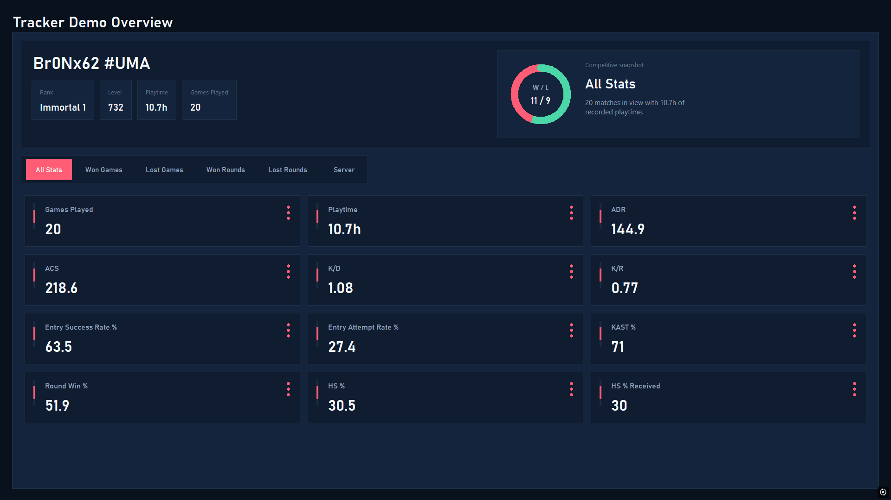
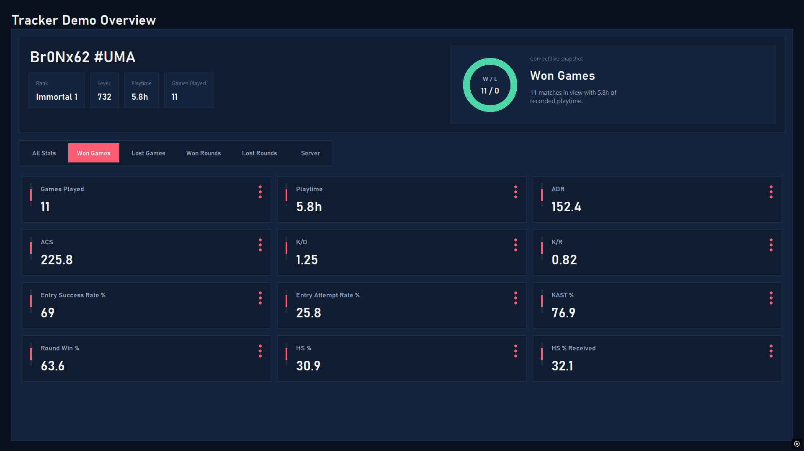
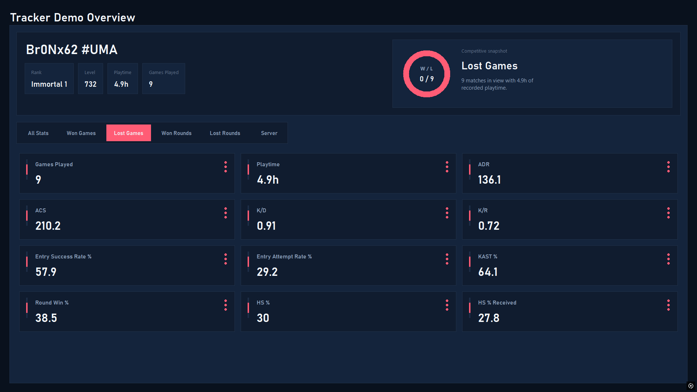
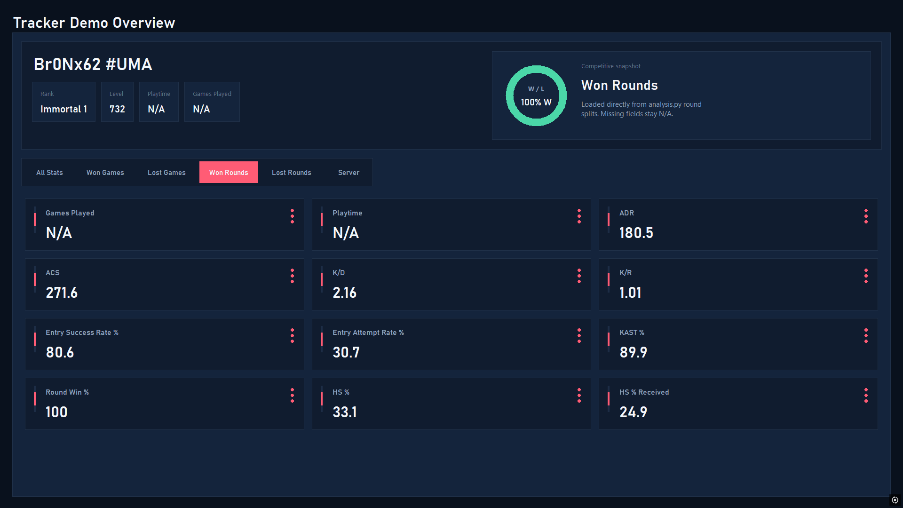
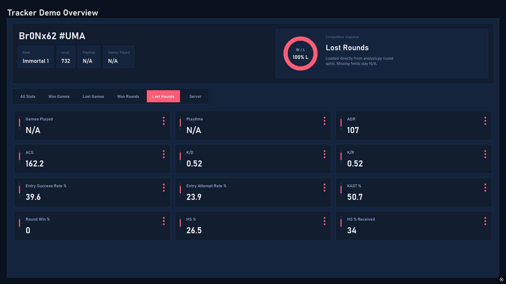
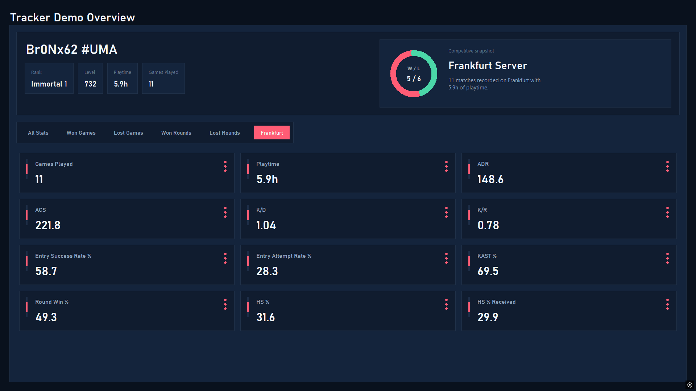
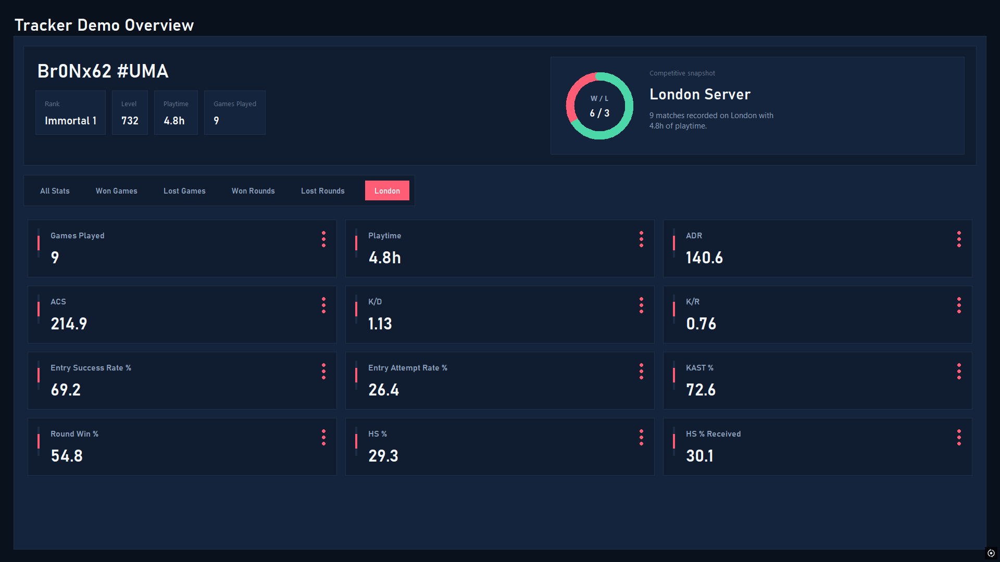

# Tracker Demo

`Tracker Demo` is a small Python desktop app for exploring competitive VALORANT match performance. It pulls match data, runs a local analysis pass, and renders the results in a custom Tkinter dashboard with split views for all matches, wins, losses, round outcomes, and server-specific summaries.

## What It Shows

- Player snapshot: Riot name, rank, account level, playtime, and match count
- Match-level views: all games, won games, and lost games
- Round-level views: won rounds and lost rounds
- Server breakdowns: separate stats for servers such as Frankfurt and London
- Core metrics: ADR, ACS, K/D, K/R, KAST, entry rates, round win rate, and headshot percentages

## Screenshots

### All Stats



### Won Games



### Lost Games



### Won Rounds



### Lost Rounds



### Frankfurt Server



### London Server



## How It Works

1. `start.py` calls `retrieve_match_data.py` to fetch match data and save it to `match_data.json`.
2. `analysis.py` reads `match_data.json` and `puuid_data.json`, then computes summary stats.
3. `tracker_gui.py` launches the Tkinter dashboard and displays the parsed analysis output.

## Requirements

- Windows
- Python 3
- `requests`
- A local VALORANT / Riot Client installation for live data retrieval
- The Riot client running and logged in if you want to fetch fresh data

`tkinter`, `pathlib`, and most of the other modules used here are part of the Python standard library.

## Quick Start

### Option 1: Run the dashboard with the bundled sample data

```powershell
python tracker_gui.py
```

This is the fastest way to view the UI because the repository already includes `match_data.json` and `puuid_data.json`.

### Option 2: Pull fresh match data first

Install the dependency:

```powershell
pip install requests
```

Then run:

```powershell
python start.py
python tracker_gui.py
```

## Files

- `tracker_gui.py`: Tkinter dashboard UI
- `analysis.py`: stat aggregation and formatting
- `retrieve_match_data.py`: downloads recent competitive matches
- `leaderboard_puuids_retriever.py`: gets a PUUID used for the fetch flow
- `local_api.py`: reads the Riot lockfile and builds authenticated headers
- `capture_tracker_screenshots.py`: captures fullscreen screenshots of each dashboard view
- `match_data.json`: saved match sample
- `puuid_data.json`: saved player identifier sample
- `weapon_uuids.json`: weapon metadata used during analysis

## Notes

- The current data retrieval flow is tightly coupled to Riot's local client APIs and hard-coded EU endpoints.
- The fetch script currently authenticates through the local Riot client but retrieves matches for a leaderboard-selected PUUID, not necessarily the logged-in player.
- If live retrieval fails, you can still launch the GUI against the included JSON data.
